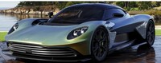
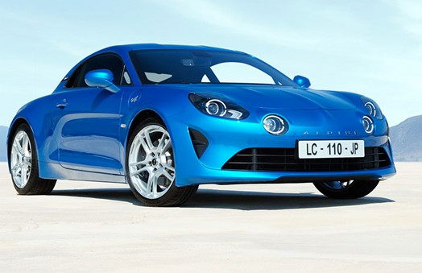
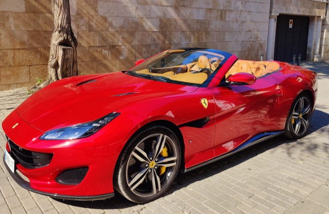

# Aficionado a los Coches - Iñaki Borrego
## Información Personal
 - **Ubicación:** Circuito Ricardo Tormo (Cheste)
 - **Instagram:**
[@iñaki_coches_entusiasta](https://www.instagram.com/coches_alta_gama_y_deportivos/)
## Pasión por los Coches
 Desde mi infancia, he tenido un amor inquebrantable por la F1 y Fernando Alonso, lo que me a llebado a meterme en la Industria del motor. Mi afición por los coches deportivos me ha llevado a explorar diferentes aspectos de esta emocionante industria.
  ## Coches Favoritos
 - Ferrari Portofinmo
 - Alpine A110
 - Aston Martin Valhalla
 ## Experiencia en Carreras
 - He participado en varias carreras de autos deportivos y he tenido la oportunidad de
experimentar la adrenalina de la velocidad en el circuito de carreras local.

## Fotos de Coches

## Eventos Futuros
Estoy emocionado por asistir al Salón del Automóvil de este año y ver las últimas
novedades en la industria automotriz.